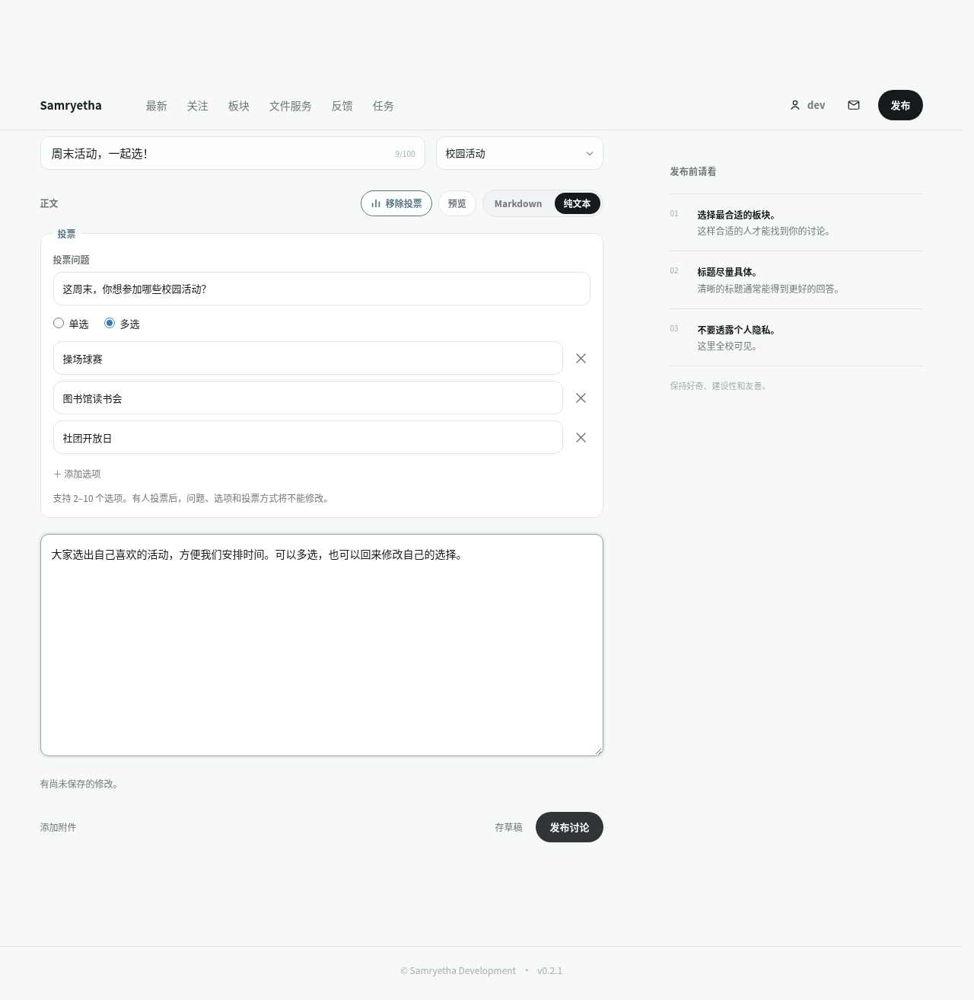
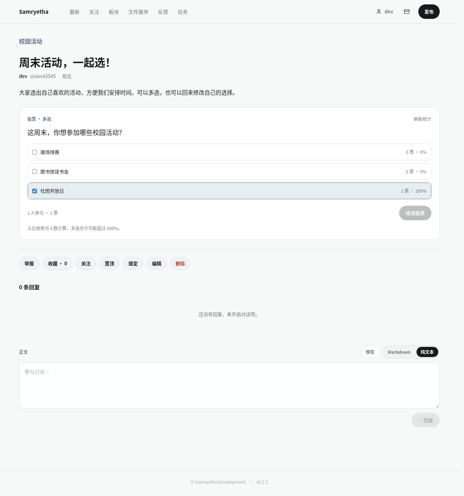

# 帖子内嵌投票

发帖和编辑帖子时，正文编辑器上方的「投票」按钮可添加一份投票。每帖最多一份，包含问题（去除首尾空白后 1–200 字符）、2–10 个不重复选项（各 1–100 字符）以及单选/多选设置。纯文本和 Markdown 正文均支持投票。草稿保留尚未填写完的投票；发布时必须完整有效。

## API

- `POST /api/discussions` 接受可选 `poll: { question, allowMultiple, options: string[] }`，随帖子及附件在同一事务内保存。
- `PATCH /api/discussions/{id}` 可增加或修改投票；显式 `poll: null` 移除投票，省略则保留。只沿用原有帖子编辑权限。首次有人投票后，问题、模式、选项及移除操作均不可改变（409），正文仍可编辑。提交完全相同的配置不改变选项 ID 或已有票数。
- 帖子详情含可空 `poll`：`question`、`allowMultiple`、`options: [{ id, label, voteCount }]`、`totalVoters`、`totalVotes`、`viewerOptionIds` 和 `canVote`。
- `PUT /api/discussions/{id}/poll/vote` 接受 `{ optionIds: number[] }`，返回最新 `PollResponse`。只接受本投票的有效选项，不允许空、重复、超量或跨投票选项；单选严格限制一项。再次提交原子替换该账号的选择，重复提交不会增加人数或票数。

统计对能查看帖子的用户开放（公开帖含访客），只返回汇总和当前用户自己的选择，不返回投票人名单。占比由前端按 `voteCount / totalVoters` 计算；多选总占比可能超过 100%。提交后立即刷新统计，也可通过「刷新统计」获取最新结果。

## 权限与一致性

投票要求已登录的 active 账号，且父帖可读、未删除、未被当前账号举报隐藏、未锁定。管理员也不能对锁定帖投票。板块的 private/members 权限与帖子详情保持一致。写入先获取 SQLite 写锁，再复核账号、父帖及权限；改票、配置修改及发帖共享请求级事务。配置修改与首票串行执行：投票先提交后，配置不可再变；配置先变更时旧选项 ID 会失效。

本功能不新增通知或 outbox 事件。投票统计按唯一账号计参与人数，按选项计票数，使用同一条聚合查询读取统计快照；没有单独的冗余计数器。

## 存储和升级

`core/schema.py` 新增 `discussion_polls`（discussion_id 主键）、`poll_options`（全局自增选项 ID，父帖/顺序唯一）和 `poll_votes`（discussion_id/user_id/option_id 复合主键）。复合外键保证选项属于同一投票；删除投票配置级联清除选项和票，但有票时业务层禁止修改或删除配置。帖子软删除后数据仍保留，访问由父帖权限拒绝。

`discussion_drafts.poll_json` 是可空 JSON 文本，保存部分投票。应用启动的 `create_schema()` / `ensure_schema_drift()` 幂等创建新表、给旧草稿表补列，旧帖子和草稿默认无投票，无需新环境变量或手动改库。

## 验证

`backend/tests/test_polls.py` 覆盖单选/多选、统计、更改选择、重复与并发提交、无效及跨投票选项、投票配置冻结、草稿发布回滚、访问权限和旧库升级。前后端 OpenAPI 生成物与实际契约一同更新。

登录、退出及切换账号后，投票组件自动重新读取当前账号的权限和选择；读取完成前禁止提交，旧会话的迟到响应不会覆盖新会话数据。读取失败可通过「刷新统计」重试。

在 `frontend/` 运行 `node scripts/polls-smoke.cjs`，可在 StrictMode 下检查登录、退出、账号切换、旧会话响应隔离、配置刷新、失败重试、重复点击、帖子锁定和移除投票。该检查也在 PR 的前端 CI 中运行。

## 页面截图

编辑器：

帖子内统计：

